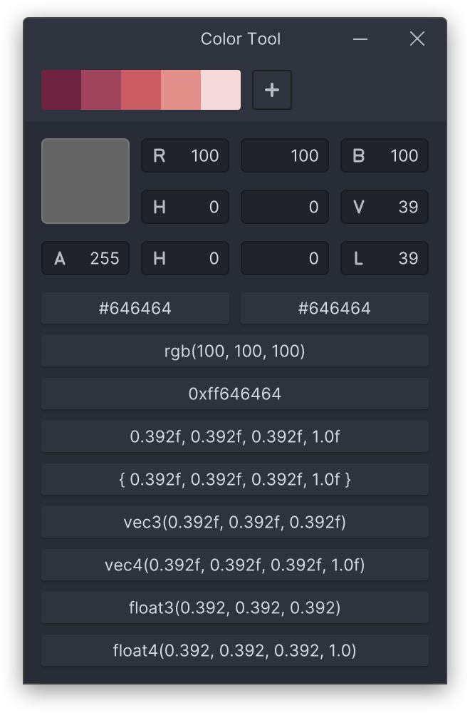

# CUI - C User Interface

CUI is basic user interface library for the c programming language.

<picture>
  <source srcset="./screenshots/color_tool_wayland.png 2x">
  
</picture>

## Support matrix

| operating system | backend(s)   | software renderer  | opengl es 2.0 renderer | metal renderer     | direct3d11 renderer |
| ---              | ---          | ---                | ---                    | ---                | ---                 |
| Linux            | X11, Wayland | :heavy_check_mark: | :heavy_check_mark:     | :x:                | :x:                 |
| macOS            | AppKit       | :heavy_check_mark: | :x:                    | :heavy_check_mark: | :x:                 |
| Windows          | Win32        | :heavy_check_mark: | :x:                    | :x:                | :heavy_check_mark:  |
| Android          | Android      | :x:                | :heavy_check_mark:     | :x:                | :x:                 |

## Usage

To use CUI in your project you just need the header file under `include/` and
one of the generated libraries (static or dynamic) to link against.

```c
#include <cui.h>
```

## Compile

### Linux

```
./build_linux.sh [debug|reldebug|release]
```

This creates a Debug (`debug`), Release Debug (`reldebug`) or Release
(`release`) build. The result can be found under `build/`. You can use the
dynamic (`libcui.so`) or the static (`libcui.a`) library.

Per default the build will use background jobs to parallelize the compilation.
This will lead to error messages getting printed out of order. To get them in
order use `./build_linux.sh -no_jobs [debug|reldebug|release]`.

### macOS

```
./build_macos.sh [debug|reldebug|release]
```

This creates a Debug (`debug`), Release Debug (`reldebug`) or Release
(`release`) build. The result can be found under `build/`. You can use the
dynamic (`libcui.so`) or the static (`libcui.a`) library.

Per default the build will use background jobs to parallelize the compilation.
This will lead to error messages getting printed out of order. To get them in
order use `./build_macos.sh -no_jobs [debug|reldebug|release]`.

### Windows

```
./build_windows.bat [debug|reldebug|release]
```

This creates a Debug (`debug`), Release Debug (`reldebug`) or Release
(`release`) build. The result can be found under `build/`. You can use the
static library `cui.lib`.

### Android

```
./build_android.sh [debug|reldebug|release]
```

This creates a Debug (`debug`), Release Debug (`reldebug`) or Release
(`release`) build. The result can be found under `build/android/`. You can use the
dynamic (`libcui.so`) or the static (`libcui.a`) library.

Per default the build will use background jobs to parallelize the compilation.
This will lead to error messages getting printed out of order. To get them in
order use `./build_android.sh -no_jobs [debug|reldebug|release]`.

## Configuration

If you want to configure your CUI build to your liking you can create a `build_config_<platform>.sh`
file for Linux, macOS and Android to set the different build settings mentioned at the start of
each `build_<platform>.sh` file. This for example is a configuration for Linux in which only
Wayland with the OpenGL ES 2.0 renderer will be build:

```
# Filename: build_config_linux.sh

CUI_BACKEND_X11="off"
CUI_BACKEND_WAYLAND="on"

CUI_RENDERER_SOFTWARE="off"
CUI_RENDERER_OPENGLES2="on"
```

These configuration files are currently **not** supported on Windows.

## Examples

CUI comes with a few example projects which should give you a pretty good idea on
how to use it in your own code. You can find all of these in `examples`. All examples
are build with CUI automatically. Just run one of the `build_*` files mentioned above.

  - `color_tool` - Color conversion tool
  - `file_search` - A file search utility
  - `image_viewer` - Simple image viewer which supports QOI, BMP and JPEG
  - `interface_browser` - An overview app for all the available widget types
